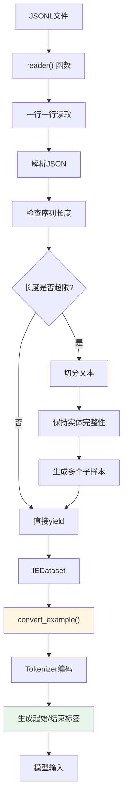

# Phase 2 学习总结：数据格式与处理

> 📍 **学习目标**：掌握数据格式转换、理解数据处理流程、学会设计有效的 Prompt

---

## 📊 1. 数据格式对比

### 1.1 CMeIE 原始格式（医疗知识图谱数据）

**示例数据**（来自实际数据集）：

```json
{
  "text": "类癌综合征@类癌综合征患者手术前应该开始输注奥曲肽以防止类癌瘤危象。",
  "spo_list": [
    {
      "predicate": "相关（导致）",
      "subject": "类癌综合征",
      "subject_type": "疾病",
      "object": {
        "@value": "类癌瘤危象"
      },
      "object_type": {
        "@value": "疾病"
      }
    },
    {
      "predicate": "药物治疗",
      "subject": "类癌瘤危象",
      "subject_type": "疾病",
      "object": {
        "@value": "奥曲肽"
      },
      "object_type": {
        "@value": "药物"
      }
    }
  ]
}
```

**字段说明**：
- `text`: 原始医疗文本
- `spo_list`: Subject-Predicate-Object 三元组列表
  - `subject`: 主体实体（如"类癌综合征"）
  - `predicate`: 关系类型（如"药物治疗"）
  - `object`: 客体实体（如"奥曲肽"）
  - `subject_type` / `object_type`: 实体类型

### 1.2 UIE 训练格式（模型实际需要的格式）

**同样的数据需要转换为多条训练样本**：

#### 样本 1：抽取"疾病"实体

```json
{
  "content": "类癌综合征@类癌综合征患者手术前应该开始输注奥曲肽以防止类癌瘤危象。",
  "prompt": "疾病",
  "result_list": [
    {
      "text": "类癌综合征",
      "start": 0,
      "end": 5
    },
    {
      "text": "类癌综合征",
      "start": 6,
      "end": 11
    },
    {
      "text": "类癌瘤危象",
      "start": 32,
      "end": 37
    }
  ]
}
```

#### 样本 2：抽取"类癌瘤危象的药物治疗"

```json
{
  "content": "类癌综合征@类癌综合征患者手术前应该开始输注奥曲肽以防止类癌瘤危象。",
  "prompt": "类癌瘤危象的药物治疗",
  "result_list": [
    {
      "text": "奥曲肽",
      "start": 23,
      "end": 26
    }
  ]
}
```

**关键理解**：
- 一条 CMeIE 数据 → 转换为多条 UIE 训练样本
- 每条样本有一个 `prompt`（提示词）
- `result_list` 包含实体的文本内容和位置

---

## 🔄 2. 数据转换详解

### 2.1 转换策略

**从 CMeIE 的一个 SPO 三元组可以生成两类训练样本**：

#### 策略 1：实体抽取样本
```python
# 从 SPO 中提取实体
prompt = subject_type  # 如 "疾病"
result = subject       # 如 "类癌综合征"
```

#### 策略 2：关系抽取样本
```python
# 从 SPO 中提取关系
prompt = subject + "的" + predicate  # 如 "类癌瘤危象的药物治疗"
result = object["@value"]            # 如 "奥曲肽"
```

### 2.2 完整转换示例

**输入** (CMeIE 格式)：
```json
{
  "text": "糖尿病患者应该服用二甲双胍",
  "spo_list": [
    {
      "subject": "糖尿病",
      "subject_type": "疾病",
      "predicate": "药物治疗",
      "object": {"@value": "二甲双胍"},
      "object_type": {"@value": "药物"}
    }
  ]
}
```

**输出** (UIE 格式，生成 3 条样本)：

```python
# 样本 1: 抽取疾病
{
  "content": "糖尿病患者应该服用二甲双胍",
  "prompt": "疾病",
  "result_list": [
    {"text": "糖尿病", "start": 0, "end": 3}
  ]
}

# 样本 2: 抽取药物
{
  "content": "糖尿病患者应该服用二甲双胍",
  "prompt": "药物",
  "result_list": [
    {"text": "二甲双胍", "start": 11, "end": 15}
  ]
}

# 样本 3: 抽取关系（糖尿病的药物治疗）
{
  "content": "糖尿病患者应该服用二甲双胍",
  "prompt": "糖尿病的药物治疗",
  "result_list": [
    {"text": "二甲双胍", "start": 11, "end": 15}
  ]
}
```

---

## 🛠️ 3. 数据处理流程

### 3.1 从文件读取到模型输入



### 3.2 核心函数：`convert_example()`

**功能**：将 UIE 格式数据转换为模型输入

**输入**：
```python
example = {
    "content": "患者确诊为糖尿病",
    "prompt": "疾病",
    "result_list": [
        {"text": "糖尿病", "start": 5, "end": 8}
    ]
}
```

**处理步骤**：

#### 步骤 1：拼接 Prompt 和 Content
```python
tokenizer(
    text=["疾病"],              # Prompt
    text_pair=["患者确诊为糖尿病"],  # Content
    max_length=512,
    add_special_tokens=True
)
```

**结果**：
```
[CLS] 疾 病 [SEP] 患 者 确 诊 为 糖 尿 病 [SEP]
  0   1  2   3    4  5  6  7  8  9 10 11  12
```

> 💡 **重要补充：特殊标记 [CLS] 和 [SEP]**

### 📌 什么是 [CLS] 和 [SEP]？

这些是 **BERT 模型的特殊标记（Special Tokens）**，所有基于 BERT 的模型（包括 ERNIE）都要使用！

#### `[CLS]` - Classification Token

- **位置**：永远在**最开头**
- **含义**：句子开始标记
- **作用**：在分类任务中，这个位置的输出向量代表整个句子的语义

#### `[SEP]` - Separator Token

- **位置**：
  - Prompt 和 Content 之间（分隔两段文本）
  - 句子结束（表示输入结束）
- **含义**：分隔符
- **作用**：告诉模型"前面一段结束了，后面是新的一段"

#### UIE 的输入格式

```
[CLS]  Prompt  [SEP]  Content  [SEP]
  ↑      ↑       ↑       ↑       ↑
开始   提示词   分隔   实际文本   结束
```

**具体例子**：
```
[CLS]  疾病  [SEP]  患者确诊为糖尿病  [SEP]
  0    1 2    3      4 5 6 7 8 9 10 11  12
```

**特殊标记的 Token ID**：

| 标记 | Token ID | 含义 |
|------|----------|------|
| `[CLS]` | 101 | 分类/开始标记 |
| `[SEP]` | 102 | 分隔符 |
| `[PAD]` | 0 | 填充 |
| `[UNK]` | 100 | 未知词 |

**类比理解**：
```
[CLS] = 文章开头的标题
[SEP] = 段落之间的分隔线
```

---

#### 步骤 2：计算偏移量映射

> ⚠️ **关键概念：两个独立的坐标系！**

在理解 offset_mapping 之前，**必须先理解这个核心概念**：

### 🎯 为什么有两个坐标系？

Tokenizer 会拼接 Prompt 和 Content：
```
原始输入:
  prompt = "疾病"
  content = "患者确诊为糖尿病"

拼接后:
  [CLS] 疾病 [SEP] 患者确诊为糖尿病 [SEP]
```

**但是**，offset_mapping **不记录拼接后的位置**，而是：
- Prompt 部分 → 记录相对 **Prompt 原文**的位置
- Content 部分 → 记录相对 **Content 原文**的位置

### 📊 两个坐标系图解

```
坐标系 1 (Prompt):
"疾病"
 ↑ ↑ ↑
 0 1 2

坐标系 2 (Content):
"患者确诊为糖尿病"
 ↑ ↑ ↑ ↑ ↑ ↑ ↑ ↑ ↑
 0 1 2 3 4 5 6 7 8

Token序列:
[CLS] 疾 病 [SEP] 患 者 确 诊 为 糖 尿 病 [SEP]
  0   1  2   3    4  5  6  7  8  9 10 11  12
      ↑           ↑
   用坐标系1     用坐标系2
   (Prompt)     (Content)
```

### 🔍 Offset Mapping 详解

```python
# offset_mapping 记录每个 token 对应原文的位置
offset_mapping = [
    # 区域1: 特殊token
    [0, 0],   # [CLS] - 不对应任何原文
    
    # 区域2: Prompt部分 (使用 Prompt 坐标系)
    [0, 1],   # 疾 → prompt[0:1] = "疾" ✅
    [1, 2],   # 病 → prompt[1:2] = "病" ✅
    
    # 区域3: 分隔符
    [0, 0],   # [SEP] - 特殊token
    
    # 区域4: Content部分 (使用 Content 坐标系，重新从0开始！)
    [0, 1],   # 患 → content[0:1] = "患" ✅ (不是拼接后的位置4！)
    [1, 2],   # 者 → content[1:2] = "者" ✅
    [2, 3],   # 确 → content[2:3] = "确"
    [3, 4],   # 诊 → content[3:4] = "诊"
    [4, 5],   # 为 → content[4:5] = "为"
    [5, 6],   # 糖 → content[5:6] = "糖" ← 实体开始！
    [6, 7],   # 尿 → content[6:7] = "尿"
    [7, 8],   # 病 → content[7:8] = "病" ← 实体结束！
    
    # 区域5: 结束符
    [0, 0]    # [SEP]
]
```

### 💡 关键理解

**为什么 token位置1 和 token位置4 都是 `[0,1]`？**

```
Token位置1: [0,1] → 表示 prompt[0:1] = "疾"
Token位置4: [0,1] → 表示 content[0:1] = "患"

两者数字一样，但参照的原文不同！
- 位置1参照 Prompt 坐标系
- 位置4参照 Content 坐标系
```

**对比表**：

| Token位置 | Token | offset_mapping | 含义 | 参照哪个坐标系？ |
|----------|-------|----------------|------|----------------|
| 1 | 疾 | `[0, 1]` | prompt[0:1] | Prompt坐标系 |
| 2 | 病 | `[1, 2]` | prompt[1:2] | Prompt坐标系 |
| 4 | 患 | `[0, 1]` | content[0:1] | Content坐标系 ⚡ |
| 5 | 者 | `[1, 2]` | content[1:2] | Content坐标系 ⚡ |
| 9 | 糖 | `[5, 6]` | content[5:6] | Content坐标系 |

### 记忆口诀

```
Prompt 和 Content 两个世界
各有各的坐标系
Prompt部分用Prompt坐标 (从0开始)
Content部分用Content坐标 (重新从0开始)
特殊token永远 [0, 0]
```

---

#### 步骤 3：生成起始/结束标签
```python
# result_list 中说 "糖尿病" 从位置 5 到 8
start_ids = [0, 0, 0, 0, 0, 0, 0, 0, 0, 1, 0, 0, 0]
                                        ↑ 位置 9 对应 "糖"

end_ids   = [0, 0, 0, 0, 0, 0, 0, 0, 0, 0, 0, 1, 0]
                                              ↑ 位置 11 对应 "病"
```

**输出**：
```python
(
    input_ids,       # Token IDs
    token_type_ids,  # Segment IDs (0=Prompt, 1=Content)
    attention_mask,  # 注意力掩码
    start_ids,       # 起始位置标签
    end_ids          # 结束位置标签
)
```

---

## 💡 4. Prompt 设计技巧

### 4.1 Prompt 的类型

#### 类型 1：实体抽取 Prompt（简单）
```python
# 直接用实体类型
prompt = "疾病"
prompt = "症状"
prompt = "药物"
```

#### 类型 2：关系抽取 Prompt（复杂）
```python
# 格式: Subject + "的" + Predicate
prompt = "糖尿病的临床表现"
prompt = "高血压的药物治疗"
prompt = "肺炎的病因"
```

#### 类型 3：描述性 Prompt（更清晰）
```python
# 更详细的描述
prompt = "文本中提到的疾病名称"
prompt = "患者的临床症状"
prompt = "医生推荐的治疗药物"
```

### 4.2 Prompt 设计示例

**场景：从病历中抽取信息**

**病历文本**：
```
患者李某，男，58岁，主诉：反复咳嗽、咳痰2周。
诊断：慢性阻塞性肺疾病急性加重。
治疗方案：布地奈德、沙丁胺醇雾化吸入。
```

**不同 Prompt 的效果**：

````carousel
### Prompt 1: 疾病
```json
{
  "prompt": "疾病",
  "result_list": [
    {"text": "慢性阻塞性肺疾病急性加重", "start": 22, "end": 35}
  ]
}
```
<!-- slide -->
### Prompt 2: 症状
```json
{
  "prompt": "症状",
  "result_list": [
    {"text": "咳嗽", "start": 15, "end": 17},
    {"text": "咳痰", "start": 18, "end": 20}
  ]
}
```
<!-- slide -->
### Prompt 3: 药物
```json
{
  "prompt": "药物",
  "result_list": [
    {"text": "布地奈德", "start": 42, "end": 46},
    {"text": "沙丁胺醇", "start": 47, "end": 51}
  ]
}
```
<!-- slide -->
### Prompt 4: 慢性阻塞性肺疾病的治疗方案
```json
{
  "prompt": "慢性阻塞性肺疾病的治疗方案",
  "result_list": [
    {"text": "布地奈德", "start": 42, "end": 46},
    {"text": "沙丁胺醇", "start": 47, "end": 51},
    {"text": "雾化吸入", "start": 51, "end": 55}
  ]
}
```
````

### 4.3 常见医疗关系的 Prompt

| 关系类型 | Prompt 示例 |
|---------|-----------|
| 病因 | "XX的病因"、"导致XX的原因" |
| 临床表现 | "XX的临床表现"、"XX的症状" |
| 药物治疗 | "XX的药物治疗"、"治疗XX的药物" |
| 辅助检查 | "XX的辅助检查"、"诊断XX的检查" |
| 鉴别诊断 | "XX的鉴别诊断"、"与XX相似的疾病" |
| 并发症 | "XX的并发症"、"XX可能导致的疾病" |

---

## 🧪 5. 实战练习

### 练习 1：手动转换数据

**给定 CMeIE 数据**：
```json
{
  "text": "高血压患者应限制钠盐摄入，可使用氢氯噻嗪降压。",
  "spo_list": [
    {
      "subject": "高血压",
      "subject_type": "疾病",
      "predicate": "药物治疗",
      "object": {"@value": "氢氯噻嗪"},
      "object_type": {"@value": "药物"}
    }
  ]
}
```

**任务**：转换为 3 条 UIE 格式样本

<details>
<summary>点击查看答案</summary>

```python
# 样本 1: 抽取疾病
{
  "content": "高血压患者应限制钠盐摄入，可使用氢氯噻嗪降压。",
  "prompt": "疾病",
  "result_list": [
    {"text": "高血压", "start": 0, "end": 3}
  ]
}

# 样本 2: 抽取药物
{
  "content": "高血压患者应限制钠盐摄入，可使用氢氯噻嗪降压。",
  "prompt": "药物",
  "result_list": [
    {"text": "氢氯噻嗪", "start": 18, "end": 22}
  ]
}

# 样本 3: 抽取关系
{
  "content": "高血压患者应限制钠盐摄入，可使用氢氯噻嗪降压。",
  "prompt": "高血压的药物治疗",
  "result_list": [
    {"text": "氢氯噻嗪", "start": 18, "end": 22}
  ]
}
```
</details>

---

### 练习 2：计算位置索引

**文本**：`"患者确诊为2型糖尿病"`

**问题**：
1. "糖尿病" 的 `start` 和 `end` 是多少？
2. "2型糖尿病" 的 `start` 和 `end` 是多少？

<details>
<summary>点击查看答案</summary>

```python
文本 = "患者确诊为2型糖尿病"
索引:  0 1 2 3 4 5 6 7 8 9

# "糖尿病" 
# 开始位置: 7 (糖)
# 结束位置: 10 (病的下一个位置)
{"text": "糖尿病", "start": 7, "end": 10}

# "2型糖尿病"
# 开始位置: 5 (2)
# 结束位置: 10
{"text": "2型糖尿病", "start": 5, "end": 10}
```

**注意**：`end` 是结束字符的**下一个位置**（左闭右开区间）
</details>

---

### 练习 3：设计 Prompt

**场景**：你需要从病历中抽取以下信息

| 信息类型 | 示例 |
|---------|------|
| 患者年龄 | "58岁" |
| 主诉症状 | "咳嗽、发热" |
| 诊断结果 | "肺炎" |
| 用药方案 | "头孢曲松" |

**任务**：为每种信息设计合适的 Prompt

<details>
<summary>点击查看参考答案</summary>

```python
prompts = {
    "年龄": "患者年龄",
    "症状": "主诉症状",
    "诊断": "诊断结果" 或 "疾病诊断",
    "用药": "治疗药物" 或 "用药方案"
}

# 更精确的 Prompt（关系抽取）
prompts_advanced = {
    "年龄": "文本中患者的年龄",
    "症状": "患者主诉的临床症状",
    "诊断": "医生给出的诊断结果",
    "用药": "医生开具的治疗药物"
}
```
</details>

---

## 📝 6. 数据统计与分析

### 6.1 数据集统计代码

创建一个数据分析脚本：

```python
# analyze_data.py
import json
from collections import Counter

def analyze_cmeie_dataset(file_path):
    """分析 CMeIE 数据集"""
    
    predicates = []  # 关系类型
    subject_types = []  # 主体类型
    object_types = []  # 客体类型
    
    with open(file_path, 'r', encoding='utf-8') as f:
        for line in f:
            data = json.loads(line)
            for spo in data['spo_list']:
                predicates.append(spo['predicate'])
                subject_types.append(spo['subject_type'])
                object_types.append(spo['object_type']['@value'])
    
    print("=" * 50)
    print("关系类型统计（Top 10）：")
    # Counter 是一个计数器，用来统计元素出现的次数。
    """
    Counter(predicates).most_common(10)
    ↓           ↓              ↓
   对象      统计元素      取前10个最常见的
    """
    for pred, count in Counter(predicates).most_common(10):
        print(f"  {pred}: {count}")
    
    print("\n" + "=" * 50)
    print("实体类型统计：")
    all_types = Counter(subject_types + object_types)
    for etype, count in all_types.most_common():
        print(f"  {etype}: {count}")

# 使用示例
analyze_cmeie_dataset('../data/annotated_data/CMeIE-V2.jsonl')
```

**预期输出**（示例）：
```
==================================================
关系类型统计（Top 10）：
  病理分型: 3500
  临床表现: 2800
  药物治疗: 2100
  病因: 1500
  ...

==================================================
实体类型统计：
  疾病: 12000
  症状: 4500
  药物: 3200
  ...
```

---

## 🎯 7. 知识检查

### 必答题

**Q1**: UIE 格式数据的三个必需字段是什么？

<details>
<summary>查看答案</summary>

**答案**：
1. `content` - 原始文本内容
2. `prompt` - 提示词，指导模型抽取什么信息
3. `result_list` - 标注结果列表，每个结果包含 `text`、`start`、`end`
</details>

---

**Q2**: 从一个 SPO 三元组可以生成几种类型的训练样本？分别是什么？

<details>
<summary>查看答案</summary>

**答案**：可以生成 **3 种** 训练样本：

1. **Subject 实体抽取样本**
   - Prompt: subject_type（如"疾病"）
   - Result: subject（如"糖尿病"）

2. **Object 实体抽取样本**
   - Prompt: object_type（如"药物"）
   - Result: object（如"二甲双胍"）

3. **关系抽取样本**
   - Prompt: subject + "的" + predicate（如"糖尿病的药物治疗"）
   - Result: object（如"二甲双胍"）
</details>

---

**Q3**: `convert_example()` 函数的核心作用是什么？

<details>
<summary>查看答案</summary>

**答案**：将 UIE 格式数据转换为模型可以直接使用的张量输入：

1. 使用 Tokenizer 编码 Prompt 和 Content
2. 计算 offset_mapping（token 到原文的映射）
3. 根据 result_list 生成起始位置标签（start_ids）
4. 根据 result_list 生成结束位置标签（end_ids）
5. 返回包含 input_ids、token_type_ids、attention_mask、start_ids、end_ids 的元组
</details>

---

**Q4**: 为什么 `end` 位置是"结束字符的下一个位置"而不是结束字符本身？

<details>
<summary>查看答案</summary>

**答案**：这是 Python 切片的标准做法（左闭右开区间）。

例如：
```python
text = "患者确诊为糖尿病"
entity = text[7:10]  # "糖尿病"
```

这样做的好处：
- 符合 Python 习惯（list[start:end]）
- 实体长度 = end - start
- 更容易处理边界情况
</details>

---

## 🚀 8. 下一步：Phase 3 预告

在 Phase 3 中，我们将深入学习：

1. **ERNIE 编码器**
   - BERT 架构回顾
   - ERNIE 的知识增强机制
   - 如何将文本转为向量

2. **指针网络详解**
   - linear_start 和 linear_end 的实现
   - 损失函数计算
   - 训练过程中的梯度流动

3. **模型架构实战**
   - 查看 model.py 源码
   - 理解前向传播过程
   - 可视化模型输出

---

## ✅ Phase 2 完成检查清单

在进入 Phase 3 之前，请确保你：

- [ ] 理解 CMeIE 和 UIE 两种数据格式的区别
- [ ] 会手动将 SPO 三元组转换为 UIE 样本
- [ ] 理解 `convert_example()` 的处理流程
- [ ] 会计算实体的 start 和 end 位置
- [ ] 会为不同任务设计合适的 Prompt
- [ ] 理解 offset_mapping 的作用
- [ ] 知道起始/结束标签是如何生成的

**完成练习题，并理解答案后，你就可以继续 Phase 3 了！** 🎉

---

> 💪 **恭喜完成 Phase 2！** 你已经掌握了数据格式转换和处理的核心知识。准备好深入模型架构了吗？
