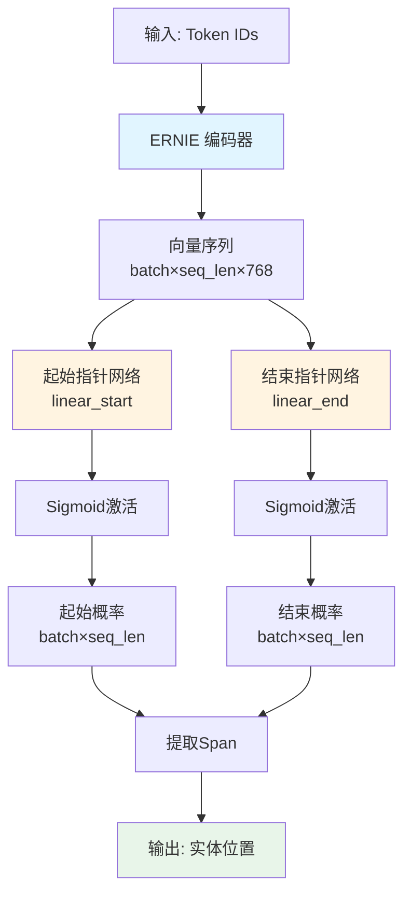

# Phase 3 学习总结：核心模型架构

> 📍 **学习目标**：深入理解 UIE 模型架构、ERNIE 编码器、指针网络和损失函数

---

## 📋 1. UIE 模型总览

### 1.1 模型架构图



### 1.2 模型代码位置

**文件**: [`model.py`](file:///Users/deyong/PycharmProjects/medical/ai-medical/uie_pytorch/model.py)

**核心类**: `UIE` 和 `UIEM`
- `UIE`: 基于 ERNIE（中文优化）
- `UIEM`: 基于 ERNIE-M（多语言版本）

---

## 🧠 2. ERNIE 编码器

### 2.1 什么是 ERNIE？

**ERNIE** = **E**nhanced **R**epresentation through k**N**owledge **I**nt**E**gration

**核心特点**：
- 基于 BERT 架构
- 增强了**实体级别**和**短语级别**的语义理解
- 特别适合中文文本处理

### 2.2 ERNIE vs BERT

| 特性 | BERT | ERNIE |
|------|------|-------|
| 预训练任务 | MLM + NSP | MLM + Entity Masking + Phrase Masking |
| Mask 单位 | 单个 Token | Token / Entity / Phrase |
| 适用语言 | 多语言 | 中文优化 |
| 实体理解 | 一般 | ⭐ 强化 |

**举例说明**：

```
文本: "北京是中国的首都"

BERT Masking:
北京 是 [MASK] 国 的 首都  ← 随机mask单个字

ERNIE Masking:
[MASK][MASK] 是 中国 的 首都  ← mask整个实体"北京"
```

### 2.3 ERNIE 架构

```
输入 Token IDs
    ↓
词嵌入 (Embedding)
    ↓
位置编码 (Position Embedding)
    ↓
Segment 编码 (Token Type IDs)
    ↓
12层 Transformer Encoder
  ├─ Multi-Head Attention
  ├─ Layer Normalization
  ├─ Feed Forward Network
  └─ Layer Normalization
    ↓
输出向量 (Hidden States)
[batch_size, seq_len, 768]
```

### 2.4 UIE 中的使用

```python
class UIE(ErniePreTrainedModel):
    def __init__(self, config):
        # 初始化 ERNIE 编码器
        self.encoder = ErnieModel(config)
        
        # hidden_size 通常是 768
        hidden_size = config.hidden_size  # 768
```

**关键参数**：
- `hidden_size`: 768（每个token的向量维度）
- `num_hidden_layers`: 12（Transformer层数）
- `num_attention_heads`: 12（注意力头数）
- `max_position_embeddings`: 512（最大序列长度）

---

## 🎯 3. 指针网络详解

### 3.1 什么是指针网络？

**定义**：两个简单的线性层，用来"指向"实体的起始和结束位置

### 3.2 代码实现

```python
class UIE(ErniePreTrainedModel):
    def __init__(self, config):
        super(UIE, self).__init__(config)
        self.encoder = ErnieModel(config)
        
        # ⭐ 指针网络核心组件
        self.linear_start = nn.Linear(768, 1)  # 起始指针
        self.linear_end = nn.Linear(768, 1)    # 结束指针
        self.sigmoid = nn.Sigmoid()            # 激活函数
```

**参数说明**：
- `nn.Linear(768, 1)`: 将768维向量压缩成1个数字
  - 输入: `[batch_size, seq_len, 768]`
  - 输出: `[batch_size, seq_len, 1]`

### 3.3 前向传播过程

#### 步骤详解

**步骤 1: ERNIE 编码**

```python
# 输入
input_ids = [101, 4519, 4567, 102, 2658, 5442, ...]
# [CLS] 疾   病  [SEP] 患   者   ...

# ERNIE 编码
outputs = self.encoder(
    input_ids=input_ids,
    token_type_ids=token_type_ids,
    attention_mask=attention_mask
)
sequence_output = outputs[0]
# 形状: [batch_size, seq_len, 768]
```

**输出示例** (简化)：
```
sequence_output = [
    [h0],   # [CLS] 的768维向量
    [h1],   # 疾 的768维向量
    [h2],   # 病 的768维向量
    ...
    [h9],   # 糖 的768维向量
    [h10],  # 尿 的768维向量
    [h11],  # 病 的768维向量
    ...
]
```

---

**步骤 2: 起始指针网络**

```python
# 起始指针
start_logits = self.linear_start(sequence_output)
# 形状: [batch_size, seq_len, 1]

# 压缩维度
start_logits = torch.squeeze(start_logits, -1)
# 形状: [batch_size, seq_len]

# Sigmoid激活
start_prob = self.sigmoid(start_logits)
# 形状: [batch_size, seq_len]
# 值域: [0, 1]
```

**示例输出**：
```python
start_prob = [
    0.01,  # [CLS]
    0.02,  # 疾
    0.01,  # 病
    0.01,  # [SEP]
    0.03,  # 患
    0.02,  # 者
    0.04,  # 确
    0.03,  # 诊
    0.05,  # 为
    0.95,  # 糖 ← 最高概率！
    0.02,  # 尿
    0.01,  # 病
    0.01   # [SEP]
]
```

---

**步骤 3: 结束指针网络**

```python
# 结束指针
end_logits = self.linear_end(sequence_output)
end_logits = torch.squeeze(end_logits, -1)
end_prob = self.sigmoid(end_logits)
```

**示例输出**：
```python
end_prob = [
    0.01,  # [CLS]
    0.01,  # 疾
    0.02,  # 病
    0.01,  # [SEP]
    0.02,  # 患
    0.03,  # 者
    0.04,  # 确
    0.03,  # 诊
    0.02,  # 为
    0.05,  # 糖
    0.06,  # 尿
    0.92,  # 病 ← 最高概率！
    0.01   # [SEP]
]
```

---

**步骤 4: 提取实体**

```python
# 找到概率最高的位置
start_idx = torch.argmax(start_prob)  # → 9
end_idx = torch.argmax(end_prob)      # → 11

# 提取实体
# 注意: 实际代码中用阈值筛选，不只是argmax
entity = tokens[start_idx:end_idx+1]
# → "糖尿病"
```

### 3.4 为什么叫"指针"？

**类比理解**：

```
传统 NER (BIO标注):
患 者 确 诊 为 糖 尿 病
O  O  O  O  O  B  I  I  ← 给每个字打标签

指针网络:
患 者 确 诊 为 糖 尿 病
👇             👇  👇
起始指针指这里→   │   │
                 │  └← 结束指针指这里
                 └─────── 提取中间的span
```

**优势**：
- ✅ 不需要复杂的标签序列
- ✅ 支持嵌套实体（一个实体包含另一个）
- ✅ 支持重叠实体（共享部分文字）
- ✅ 更直观、更灵活

---

## 🔢 3.5 激活函数：Sigmoid

### 什么是激活函数？

**定义**：将线性层的输出（logit）转换为特定范围的函数，引入非线性。

### Sigmoid 函数详解

**数学公式**：

```
σ(x) = 1 / (1 + e^(-x))

其中:
  x: 输入值（任意实数）
  e: 自然对数的底 (≈2.718)
  σ(x): 输出值（0到1之间）
```

**函数特性**：

```
输入范围: -∞ ~ +∞
输出范围: 0 ~ 1

特殊值:
  σ(-∞) = 0
  σ(0)  = 0.5
  σ(+∞) = 1
```

**图形表示**：

```
  1.0 |         ╭────────
      |       ╱
  0.5 |     ╱  ← σ(0) = 0.5
      |   ╱
  0.0 | ──╯
      |___________________
      -5   0      5   10  x

x = -10 → σ(x) = 0.00005 (接近0)
x = -5  → σ(x) = 0.007
x = 0   → σ(x) = 0.5
x = 5   → σ(x) = 0.993
x = 10  → σ(x) = 0.99995 (接近1)
```

### 在 UIE 中的作用

**完整数据流**：

```python
# 步骤1: 线性层输出 (logit)
h = [0.12, -0.45, ..., 0.34]  # 768维向量
logit = linear_start(h)  # → 3.5 (任意实数)

# 步骤2: Sigmoid 激活
prob = sigmoid(3.5)
     = 1 / (1 + e^(-3.5))
     = 1 / (1 + 0.0302)
     = 0.97  # 转换为概率！
```

**为什么要用 Sigmoid？**

| 没有Sigmoid | 有Sigmoid |
|-----------|----------|
| logit = [-10, -5, 0, 3, 8] | prob = [0.00, 0.01, 0.50, 0.95, 1.00] |
| 无范围限制，难以理解 | 0-1范围，可解释为"概率" |
| 无法设置阈值 | 可以用threshold筛选（如0.5） |

**实际例子**：

```python
# 某个位置的logit
start_logits = [
    -8.5,   # [CLS]
    -6.2,   # 疾
    -7.1,   # 病
    -9.0,   # [SEP]
    -5.3,   # 患
    -4.8,   # 者
    -3.2,   # 确
    -2.7,   # 诊
    -1.5,   # 为
    +4.2,   # 糖 ← logit很大！
    -3.1,   # 尿
    -5.9,   # 病
]

# Sigmoid 后
start_prob = [
    0.0002,  # [CLS]
    0.002,   # 疾
    0.0008,  # 病
    0.0001,  # [SEP]
    0.005,   # 患
    0.008,   # 者
    0.04,    # 确
    0.06,    # 诊
    0.18,    # 为
    0.985,   # 糖 ← 概率接近1！
    0.04,    # 尿
    0.003,   # 病
]
```

### PyTorch 实现

```python
import torch
import torch.nn as nn

# 创建 Sigmoid
sigmoid = nn.Sigmoid()

# 使用
logits = torch.tensor([-5.0, -2.0, 0.0, 2.0, 5.0])
probs = sigmoid(logits)
print(probs)
# tensor([0.0067, 0.1192, 0.5000, 0.8808, 0.9933])
```

---

## 📉 4. 损失函数

### 4.1 什么是损失函数？

**定义**：损失函数（Loss Function）用来衡量模型预测值和真实标签之间的差距。

**作用**：
- 训练目标：最小化损失
- 损失越小 = 预测越准确
- 通过反向传播更新模型参数

**常见损失函数对比**：

| 损失函数 | 适用场景 | 输出范围 |
|---------|---------|---------|
| Mean Squared Error (MSE) | 回归任务 | [0, +∞) |
| Cross Entropy | 多分类（互斥） | [0, +∞) |
| **Binary Cross Entropy (BCE)** | **二元分类/多标签** | **[0, +∞)** |

---

### 4.2 BCE Loss (Binary Cross Entropy)

**全称**：二元交叉熵损失

**数学公式**：

```
BCE(p, y) = -[y × log(p) + (1-y) × log(1-p)]

其中:
  p: 模型预测的概率 (0 ≤ p ≤ 1)
  y: 真实标签 (0 或 1)
  log: 自然对数
```

**直观理解**：

```
当 y = 1 (正样本):
  BCE = -log(p)
  p 越接近 1 → log(p) 越接近 0 → loss 越小
  p 越接近 0 → log(p) 越小（负数） → loss 越大

当 y = 0 (负样本):
  BCE = -log(1-p)
  p 越接近 0 → log(1-p) 越接近 0 → loss 越小
  p 越接近 1 → log(1-p) 越小（负数） → loss 越大
```

---

### 4.3 BCE Loss 计算示例

#### 示例 1：正样本预测准确

```python
真实标签: y = 1  (这个位置是实体起始)
预测概率: p = 0.95

BCE = -(1 × log(0.95) + 0 × log(0.05))
    = -log(0.95)
    = -(-0.0513)
    = 0.0513  # 损失很小 ✅
```

#### 示例 2：正样本预测错误

```python
真实标签: y = 1  (这个位置是实体起始)
预测概率: p = 0.1  # 预测错了！

BCE = -(1 × log(0.1) + 0 × log(0.9))
    = -log(0.1)
    = -(-2.303)
    = 2.303  # 损失很大 ❌
```

#### 示例 3：负样本预测准确

```python
真实标签: y = 0  (这个位置不是实体)
预测概率: p = 0.05

BCE = -(0 × log(0.05) + 1 × log(0.95))
    = -log(0.95)
    = 0.0513  # 损失很小 ✅
```

#### 示例 4：负样本预测错误

```python
真实标签: y = 0  (这个位置不是实体)
预测概率: p = 0.9  # 预测错了！

BCE = -(0 × log(0.9) + 1 × log(0.1))
    = -log(0.1)
    = 2.303  # 损失很大 ❌
```

---

### 4.4 BCE Loss 值对比表

| 真实标签 y | 预测概率 p | BCE Loss | 结果评价 |
|-----------|-----------|----------|---------|
| 1 | 0.99 | 0.01 | 预测非常准 🌟 |
| 1 | 0.95 | 0.05 | 预测准确 ✅ |
| 1 | 0.8 | 0.22 | 预测较准 ✓ |
| 1 | 0.5 | 0.69 | 完全不确定 ⚠️ |
| 1 | 0.2 | 1.61 | 预测错误 ❌ |
| 1 | 0.05 | 3.00 | 预测非常错 💥 |
| 0 | 0.01 | 0.01 | 预测非常准 🌟 |
| 0 | 0.05 | 0.05 | 预测准确 ✅ |
| 0 | 0.5 | 0.69 | 完全不确定 ⚠️ |
| 0 | 0.95 | 3.00 | 预测非常错 💥 |

**规律**：
- 预测概率越接近真实标签 → Loss 越小
- 预测概率越远离真实标签 → Loss 越大
- 完全不确定 (p=0.5) 时 Loss = 0.69

---

### 4.5 在 UIE 中的应用

#### 代码实现

```python
# 训练时
if start_positions is not None and end_positions is not None:
    loss_fct = nn.BCELoss()
    
    # 起始位置损失
    start_loss = loss_fct(start_prob, start_positions)
    
    # 结束位置损失
    end_loss = loss_fct(end_prob, end_positions)
    
    # 总损失（平均）
    total_loss = (start_loss + end_loss) / 2.0
```

#### 完整计算示例

```python
# 真实标签（start_positions）
start_positions = [0, 0, 0, 0, 0, 0, 0, 0, 0, 1, 0, 0, 0]
#                                           ↑ 位置9是起始

# 模型预测（start_prob）
start_prob = [0.01, 0.02, 0.01, 0.01, 0.03, 0.02, 0.04, 0.03, 0.05, 0.95, 0.02, 0.01, 0.01]

# BCE Loss 会对每个位置计算损失，然后平均:
# 位置0: BCE(0.01, 0) = -log(1-0.01) = 0.01
# 位置1: BCE(0.02, 0) = -log(1-0.02) = 0.02
# ...
# 位置9: BCE(0.95, 1) = -log(0.95) = 0.05  ← 预测对了！
# ...

# 平均所有位置的损失
start_loss = BCELoss(start_prob, start_positions)  # ≈ 0.08
```

#### 为什么平均两个损失？

```python
total_loss = (start_loss + end_loss) / 2.0
```

**原因**：
- 起始和结束位置同等重要
- 平均处理避免某一个占主导
- 使loss数值更稳定

---

### 4.6 为什么选择 BCE Loss？

#### UIE 的特点

```
每个位置的预测:
- 不是互斥的多分类
- 是独立的二元分类（是/否 起始位置）
- 一句话可能有多个实体（多个位置都是1）
```

#### BCE vs Cross Entropy

| 特性 | BCE Loss | Cross Entropy Loss |
|------|---------|-------------------|
| 适用场景 | 多标签分类 | 单标签多分类 |
| 标签形式 | [0,0,1,0,1,0] | [0,0,1,0,0,0] |
| 是否互斥 | 否 | 是 |
| UIE 适用性 | ✅ 完美适配 | ❌ 不适合 |

**举例说明**：

```
文本: "糖尿病和高血压是常见疾病"

起始位置标签: [1, 0, 0, 0, 1, 0, 0, 0, 0, 0, 0]
                ↑           ↑
            糖尿病        高血压

两个位置都是1 → 这是多标签问题 → 用BCE Loss ✅
```

---

## 🔄 5. 完整前向传播流程

### 5.1 代码走查

```python
def forward(self, input_ids, token_type_ids, attention_mask,
            start_positions=None, end_positions=None):
    
    # 1️⃣ ERNIE 编码
    outputs = self.encoder(
        input_ids=input_ids,
        token_type_ids=token_type_ids,
        attention_mask=attention_mask
    )
    sequence_output = outputs[0]  # [batch, seq_len, 768]
    
    # 2️⃣ 起始指针网络
    start_logits = self.linear_start(sequence_output)  # [batch, seq_len, 1]
    start_logits = torch.squeeze(start_logits, -1)     # [batch, seq_len]
    start_prob = self.sigmoid(start_logits)            # [batch, seq_len]
    
    # 3️⃣ 结束指针网络
    end_logits = self.linear_end(sequence_output)      # [batch, seq_len, 1]
    end_logits = torch.squeeze(end_logits, -1)         # [batch, seq_len]
    end_prob = self.sigmoid(end_logits)                # [batch, seq_len]
    
    # 4️⃣ 计算损失（训练时）
    total_loss = None
    if start_positions is not None and end_positions is not None:
        loss_fct = nn.BCELoss()
        start_loss = loss_fct(start_prob, start_positions)
        end_loss = loss_fct(end_prob, end_positions)
        total_loss = (start_loss + end_loss) / 2.0
    
    # 5️⃣ 返回结果
    return UIEModelOutput(
        loss=total_loss,
        start_prob=start_prob,
        end_prob=end_prob
    )
```

### 5.2 数据流动图

```
输入维度变化:

input_ids: [batch=16, seq_len=512]
    ↓ ERNIE
sequence_output: [16, 512, 768]
    ↓ linear_start
start_logits: [16, 512, 1]
    ↓ squeeze
start_logits: [16, 512]
    ↓ sigmoid
start_prob: [16, 512]  ← 每个位置的起始概率

同理:
end_prob: [16, 512]    ← 每个位置的结束概率
```

---

## 💡 6. 模型参数分析

### 6.1 参数量统计

| 组件 | 参数量 | 说明 |
|------|--------|------|
| ERNIE 编码器 | ~110M | 主体参数 |
| linear_start | 768 | 768×1权重 |
| linear_end | 768 | 768×1权重 |
| **总计** | **~110M** | 轻量级任务头 |

**关键观察**：
- 绝大部分参数在 ERNIE 编码器
- 指针网络仅增加 ~1.5K 参数
- 非常轻量的任务适配层

### 6.2 模型配置

```python
# 典型配置（uie-base）
config = {
    "hidden_size": 768,              # 隐藏层维度
    "num_hidden_layers": 12,         # Transformer层数
    "num_attention_heads": 12,       # 注意力头数
    "intermediate_size": 3072,       # FFN中间层维度
    "max_position_embeddings": 512,  # 最大序列长度
    "vocab_size": 21128             # 词表大小
}
```

---

## 🎯 7. 推理过程

### 7.1 单个样本推理

```python
# 输入
text = "患者确诊为糖尿病"
prompt = "疾病"

# Tokenize
tokens = tokenizer(
    text=[prompt],
    text_pair=[text],
    return_tensors="pt"
)

# 前向传播
with torch.no_grad():
    outputs = model(
        input_ids=tokens['input_ids'],
        token_type_ids=tokens['token_type_ids'],
        attention_mask=tokens['attention_mask']
    )

# 获取概率
start_prob = outputs.start_prob  # [1, seq_len]
end_prob = outputs.end_prob      # [1, seq_len]

# 找到大于阈值的位置
threshold = 0.5
start_ids = (start_prob > threshold).nonzero()
end_ids = (end_prob > threshold).nonzero()

# 配对成span
# ...（详细逻辑见uie_predictor.py）
```

### 7.2 阈值的作用

**threshold** (通常是 0.5)：
- 只保留概率 > 0.5 的位置
- 过滤掉低置信度的预测
- 可以调整来平衡精确率和召回率

**示例**：

```python
start_prob = [0.01, 0.02, 0.95, 0.03, 0.6, ...]
                         ↑           ↑
threshold = 0.5:         保留        保留

threshold = 0.7:         保留        过滤
```

---

## 📝 8. 实战练习

### 练习 1：计算参数量

**问题**：如果 `hidden_size=768`，`linear_start` 有多少个参数？

<details>
<summary>查看答案</summary>

```python
# linear_start: nn.Linear(768, 1)
# 参数 = 权重 + 偏置
# 权重: 768 × 1 = 768
# 偏置: 1
# 总计: 769 个参数
```
</details>

---

### 练习 2：理解损失函数

**问题**：如果模型预测 start_prob[9]=0.6，但真实标签 start_positions[9]=1，损失是多少？

<details>
<summary>查看答案</summary>

```python
# BCE Loss公式:
# loss = -(y * log(p) + (1-y) * log(1-p))

y = 1.0    # 真实标签
p = 0.6    # 预测概率

loss = -(1 * log(0.6) + 0 * log(0.4))
     = -log(0.6)
     ≈ 0.511

# 如果预测是0.95，则:
loss = -log(0.95) ≈ 0.051  # 更小！
```
</details>

---

### 练习 3：前向传播维度

**问题**：给定 batch_size=8, seq_len=128, hidden_size=768，各阶段输出维度是？

<details>
<summary>查看答案</summary>

```python
# 输入
input_ids: [8, 128]

# ERNIE输出
sequence_output: [8, 128, 768]

# linear_start输出
start_logits: [8, 128, 1]

# squeeze后
start_logits: [8, 128]

# sigmoid后
start_prob: [8, 128]

# 同理
end_prob: [8, 128]
```
</details>

---

## ✅ 9. 知识检查

### 必答题

**Q1**: UIE 模型的三个核心组件是什么？

<details>
<summary>查看答案</summary>

1. **ERNIE 编码器**：将文本转为向量表示
2. **起始指针网络** (`linear_start`)：预测实体起始位置
3. **结束指针网络** (`linear_end`)：预测实体结束位置
</details>

---

**Q2**: 为什么使用 BCE Loss 而不是 Cross Entropy Loss？

<details>
<summary>查看答案</summary>

**原因**：
- UIE 的标签是 **二值的**（每个位置是0或1）
- 每个位置**独立预测**（不是互斥的多分类）
- BCE Loss 适合处理多标签问题（一句话可能有多个实体）

**对比**：
- Cross Entropy: 用于互斥分类（NER的BIO标注）
- BCE: 用于多标签分类（UIE的指针标注）
</details>

---

**Q3**: `torch.squeeze(start_logits, -1)` 的作用是什么？

<details>
<summary>查看答案</summary>

**作用**：移除最后一个维度（如果维度是1）

```python
# 之前
start_logits: [batch_size, seq_len, 1]
              [8, 128, 1]

# squeeze后
start_logits: [batch_size, seq_len]
              [8, 128]
```

**为什么**：
- nn.Linear(768, 1) 输出形状是 [..., 1]
- 但我们需要 [...] 的形状
- squeeze 去掉多余的维度 1
</details>

---

## 🚀 10. 下一步：Phase 4 预告

在 Phase 4 中，我们将学习：

1. **模型训练流程**
   - finetune.py 脚本解析
   - 训练循环
   - 优化器和学习率
   - 模型保存和加载

2. **模型推理详解**
   - uie_predictor.py 解析
   - 多阶段推理机制
   - Schema 解析
   - 后处理和span组装

3. **实战演练**
   - 在小数据集上训练
   - 模型调优技巧
   - 错误分析

---

> 💪 **恭喜完成 Phase 3！** 你已经掌握了 UIE 的核心架构。准备好进入实战训练了吗？
