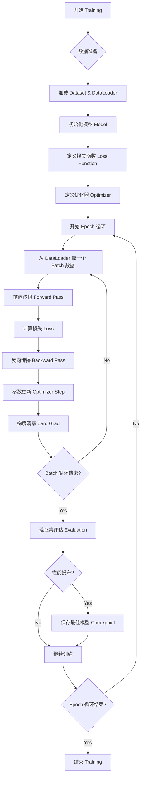

# Phase 4: 训练与推理 (Training & Inference)

## 1. 阶段目标
本阶段的目标是掌握 UIE 模型的训练和推理流程。我们将深入分析 `finetune.py`（训练脚本）和 `uie_predictor.py`（推理脚本），理解模型是如何学习和应用的。

---

## 2. 模型训练 (`finetune.py`)

训练是让模型适应特定领域数据的过程。UIE 使用微调（Fine-tuning）的方式，在预训练模型的基础上进行训练。

### 2.1 核心流程 (`do_train`)

训练过程遵循标准的 PyTorch 训练循环：

1.  **数据加载**:
    *   使用 `IEDataset` 加载训练集和验证集。
    *   使用 `DataLoader` 进行批处理 (Batching) 和打乱 (Shuffle)。
2.  **模型初始化**:
    *   加载预训练模型 (`UIE.from_pretrained`)。
    *   配置优化器 (`AdamW`)。
3.  **训练循环 (Epoch Loop)**:
    *   **前向传播 (Forward)**: 输入 `input_ids` 等，模型输出 `start_prob` 和 `end_prob`。
    *   **计算损失 (Loss)**: 使用 `BCELoss` 计算 Start 和 End 的损失，取平均值。
    *   **反向传播 (Backward)**: 计算梯度并更新参数 (`optimizer.step()`)。
4.  **模型评估 (Evaluation)**:
    *   每隔一定步数 (`valid_steps`)，在验证集上评估模型性能。
    *   使用 `SpanEvaluator` 计算 Precision, Recall, F1。
5.  **模型保存**:
    *   保存 F1 值最高的模型 (`model_best`)。
    *   支持早停机制 (`EarlyStopping`) 防止过拟合。

### 2.2 关键参数

| 参数 | 说明 | 默认值 |
| :--- | :--- | :--- |
| `--train_path` | 训练数据路径 | (必填) |
| `--dev_path` | 验证数据路径 | (必填) |
| `--save_dir` | 模型保存路径 | `./checkpoint` |
| `--learning_rate` | 学习率 | `1e-5` |
| `--batch_size` | 批大小 | `16` |
| `--num_epochs` | 训练轮数 | `100` |
### 2.3 PyTorch 训练流程详解 (Training Workflow)

为了帮你更好地理解，我整理了 PyTorch 模型训练的详细流程图：



**详细步骤说明：**

1.  **数据准备 (Data Preparation)**:
    *   将原始数据转换为模型可读的格式 (Tensor)。
    *   `DataLoader` 负责分批次 (Batch) 加载数据，并进行打乱 (Shuffle)。

2.  **前向传播 (Forward Pass)**:
    *   数据输入模型，经过层层计算，得到预测结果 (`start_prob`, `end_prob`)。

3.  **计算损失 (Loss Calculation)**:
    *   将预测结果与真实标签 (`start_ids`, `end_ids`) 进行比较。
    *   UIE 使用 `BCELoss` (二元交叉熵损失) 来衡量预测的准确度。

4.  **反向传播 (Backward Pass)**:
    *   `loss.backward()`: 根据损失值，计算每个参数的梯度 (Gradient)。梯度告诉我们参数应该往哪个方向调整才能减小损失。

5.  **参数更新 (Optimizer Step)**:
    *   `optimizer.step()`: 根据计算出的梯度，更新模型的权重参数。

6.  **梯度清零 (Zero Grad)**:
    *   `optimizer.zero_grad()`: 清空上一步的梯度，防止梯度累加干扰下一次更新。

7.  **评估与保存 (Evaluation & Save)**:
    *   定期在验证集上测试模型效果 (F1 Score)。
    *   如果发现当前模型比之前的都好，就把它保存下来 (`model_best`)。

---
---

## 3. 模型推理 (`uie_predictor.py`)

推理是利用训练好的模型从新文本中抽取信息的过程。UIE 的推理特点是**基于 Schema 的多阶段抽取**。

### 3.1 Schema 定义
Schema 定义了我们要抽取什么。它可以是简单的实体列表，也可以是复杂的层级结构。

```python
# 简单实体抽取
schema = ['人名', '地名']

# 关系抽取 (层级结构)
schema = {
    '人名': [
        '出生日期',
        '籍贯'
    ]
}
```

### 3.2 多阶段预测 (`_multi_stage_predict`)

UIE 不会一次性输出所有结果，而是像剥洋葱一样分层抽取：

1.  **第一阶段 (实体抽取)**:
    *   Prompt: "人名"
    *   Text: "张三出生于北京"
    *   Result: 提取出 "张三" (Span: [0, 2])

2.  **第二阶段 (关系/属性抽取)**:
    *   基于第一阶段的结果，构造新的 Prompt。
    *   Prompt: "张三的出生日期"
    *   Text: "张三出生于北京" (原文不变)
    *   Result: 如果原文有日期，则提取；否则为空。

这种机制使得 UIE 可以处理复杂的嵌套结构和关系抽取。

### 3.3 自动分句 (`_auto_splitter`)
如果输入文本太长（超过 `max_seq_len`），预测器会自动将其切分为多个短句进行预测，最后再合并结果。

---

## 4. 评估指标 (`evaluate.py`)

我们使用 **Span 级别的评估指标**，这意味着预测的开始位置和结束位置必须与标注**完全一致**才算正确。

*   **Precision (精确率)**: 预测出的实体中，有多少是正确的？
    *   `TP / (TP + FP)`
*   **Recall (召回率)**: 所有的真实实体中，有多少被预测出来了？
    *   `TP / (TP + FN)`
*   **F1 Score**: 精确率和召回率的调和平均数，综合反映模型性能。
    *   `2 * (P * R) / (P + R)`

---

## 5. 实战练习 (Hands-on)

为了方便实战，我们准备了以下工具脚本：

### 5.1 数据转换
原始的 `debug_data` 是 CMeIE 格式，需要转换为 UIE 格式才能训练。我们提供了 `convert_data.py` 脚本：

```bash
# 转换训练集
python3 convert_data.py --input_file debug_data/train.jsonl --output_file debug_data/train_converted.jsonl

# 转换验证集
python3 convert_data.py --input_file debug_data/dev.jsonl --output_file debug_data/dev_converted.jsonl
```

### 5.2 运行训练
我们创建了一个一键训练脚本 `run_training_debug.sh`，它会自动使用 CPU (或 GPU) 在 `debug_data` 上进行训练。

**脚本内容 (`run_training_debug.sh`)**:
```bash
python3 uie_pytorch/finetune.py \
    --train_path "debug_data/train_converted.jsonl" \
    --dev_path "debug_data/dev_converted.jsonl" \
    --save_dir "./checkpoint_debug" \
    --learning_rate 1e-4 \
    --batch_size 4 \
    --max_seq_len 512 \
    --num_epochs 10 \
    --model "bert-base-chinese" \
    --logging_steps 2 \
    --valid_steps 5 \
    --device "cpu"
```

**运行方法**:
```bash
chmod +x run_training_debug.sh
./run_training_debug.sh
```

训练完成后，模型会保存到 `./checkpoint_debug` 目录。

### 5.3 练习建议
1.  **运行脚本**：观察 Loss 的变化，看模型是否在收敛。
2.  **查看输出**：检查 `checkpoint_debug` 目录下的文件 (`config.json`, `pytorch_model.bin` 等)。
3.  **尝试修改参数**：比如修改 `learning_rate` 或 `num_epochs`，看看对训练结果的影响。


---

## 6. 总结
*   **训练**：通过 `finetune.py` 微调预训练模型，核心是 BCE Loss 和 SpanEvaluator。
*   **推理**：通过 `uie_predictor.py` 进行多阶段抽取，支持复杂的 Schema 定义。
*   **评估**：使用 Precision, Recall, F1 衡量 Span 级别的抽取效果。
