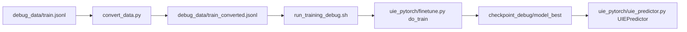

# Phase 4：从数据到训练与推理的完整实战

> 🎯 目标：带你从零跑通一次 UIE 训练 + 推理，全程对照项目源代码，做到“知道每一行在干什么”。

本章按真实开发流程来走：

1. 先把原始 CMeIE 数据转换成 UIE 格式（看懂 `convert_data.py`）
2. 再用一键脚本跑训练（顺着看 `run_training_debug.sh` 和 `finetune.py`）
3. 最后用训练好的模型做一次推理（阅读 `uie_predictor.py` 的核心逻辑）

建议边看边在项目根目录开一个终端，把代码和日志一起对照着看。

---

## 0. 前置准备

在项目根目录 `ai-medical/` 下，建议先创建并激活虚拟环境，然后安装依赖：

```bash
cd /Users/deyong/PycharmProjects/medical/ai-medical
pip install -r uie_pytorch/requirements.txt
```

确认 `debug_data/` 目录下已有 `train.jsonl`、`dev.jsonl` 等 CMeIE 格式数据。

---

## 1. 总体路线图：从文件到模型

先弄清楚整体数据和代码是如何串起来的：



后面每一小节，都会明确：
- “现在你应该做什么命令”
- “这条命令会调用哪个脚本”
- “脚本里的每一段代码在干什么”

---

## 2. 第一步：把 CMeIE 数据转换成 UIE 样本

### 2.1 先执行命令，再看代码

在项目根目录运行（如果已经跑过可以跳过，但建议再跑一遍体会流程）：

```bash
# 转换训练集
python3 convert_data.py \
  --input_file debug_data/train.jsonl \
  --output_file debug_data/train_converted.jsonl

# 转换验证集
python3 convert_data.py \
  --input_file debug_data/dev.jsonl \
  --output_file debug_data/dev_converted.jsonl
```

完成后，可以用 `head` 看一下输出格式：

```bash
head -n 3 debug_data/train_converted.jsonl
```

一行就是一条 UIE 训练样本，典型结构：

```json
{
  "content": "原始句子文本",
  "prompt": "疾病",
  "result_list": [
    {"text": "糖尿病", "start": 10, "end": 13}
  ]
}
```

### 2.2 对照源码阅读 `convert_data.py`

文件：`convert_data.py`

#### (1) 总入口：`if __name__ == "__main__":`

```python
if __name__ == "__main__":
    parser = argparse.ArgumentParser()
    parser.add_argument("--input_file", type=str, required=True)
    parser.add_argument("--output_file", type=str, required=True)
    args = parser.parse_args()
    
    convert_file(args.input_file, args.output_file)
```

逐行理解：
- `ArgumentParser()`：声明这是一个命令行脚本
- `--input_file / --output_file`：对应你刚刚在命令行传入的参数
- `parse_args()`：解析命令行
- `convert_file(...)`：用解析出的路径真正去做转换

#### (2) 单文件转换流程：`convert_file`

```python
def convert_file(input_path, output_path):
    print(f"Converting {input_path} to {output_path}...")
    with open(input_path, 'r', encoding='utf-8') as f_in, \
         open(output_path, 'w', encoding='utf-8') as f_out:
        
        for line in tqdm(f_in):
            try:
                cmeie_data = json.loads(line)
                uie_samples = cmeie_to_uie_samples(cmeie_data)
                for sample in uie_samples:
                    f_out.write(json.dumps(sample, ensure_ascii=False) + '\n')
            except Exception as e:
                print(f"Error processing line: {e}")
```

关键点：
- `for line in tqdm(f_in)`：一行一行读原始 CMeIE 数据，并显示进度条
- `json.loads(line)`：把字符串解析成 Python `dict`
- `cmeie_to_uie_samples(...)`：核心转换逻辑，一条 CMeIE 可能会变成多条 UIE 样本
- 写文件时每个 `sample` 再转回 JSON 字符串，一行一条

#### (3) 结构转换核心：`cmeie_to_uie_samples`

```python
def cmeie_to_uie_samples(cmeie_data):
    text = cmeie_data['text']
    spo_list = cmeie_data.get('spo_list', [])
    
    uie_samples = []
    
    # 用于去重的集合
    seen_entities = set()
    seen_relations = set()
    
    for spo in spo_list:
        subject = spo['subject']
        subject_type = spo['subject_type']
        predicate = spo['predicate']
        obj = spo['object']['@value']
        obj_type = spo['object_type']['@value']
        ...
```

你需要理解的几个关键变量：
- `text`：一条样本的原始句子
- `spo_list`：CMeIE 中的三元组列表（subject–predicate–object）
- `seen_entities` / `seen_relations`：防止重复生成同样的样本

函数内部分三类样本构造：

1. **Subject 实体抽取样本**
   ```python
   subject_key = (subject_type, subject)
   if subject_key not in seen_entities:
       seen_entities.add(subject_key)
       start = text.find(subject)
       if start != -1:
           uie_sample = {
               "content": text,
               "prompt": subject_type,
               "result_list": [{
                   "text": subject,
                   "start": start,
                   "end": start + len(subject)
               }]
           }
           uie_samples.append(uie_sample)
   ```
   - Prompt：实体类型（比如“疾病”）
   - Result：句子中该实体具体出现的位置

2. **Object 实体抽取样本**
   和 Subject 类似，只是用的是 object 及其类型。

3. **关系抽取样本**
   ```python
   relation_key = (subject, predicate, obj)
   if relation_key not in seen_relations:
       seen_relations.add(relation_key)
       start = text.find(obj)
       if start != -1:
           uie_sample = {
               "content": text,
               "prompt": f"{subject}的{predicate}",
               "result_list": [{
                   "text": obj,
                   "start": start,
                   "end": start + len(obj)
               }]
           }
           uie_samples.append(uie_sample)
   ```

理解到这里，你就清楚：
- CMeIE 的一条样本会拆成多条 UIE 样本
- UIE 训练只依赖三件事：原始句子、Prompt、目标 span

---

## 3. 第二步：一键脚本跑训练 + 读懂训练主循环

### 3.1 先跑起来：`run_training_debug.sh`

文件：`run_training_debug.sh`

先赋予执行权限并运行：

```bash
chmod +x run_training_debug.sh
./run_training_debug.sh
```

你会看到类似：

```text
🚀 开始 UIE 模型实战训练 (Debug 模式)...
Training Epoch 1:  10%|...
global step 2, epoch: 1, loss: ...
Evaluation precision: ..., recall: ..., F1: ...
✅ 训练完成！模型已保存到 ./checkpoint_debug
```

训练完成后，模型会保存到：
- `checkpoint_debug/model_best/`：最佳 F1 的模型（推荐推理用）

### 3.2 对照脚本逐行理解

```bash
#!/bin/bash

set -e
echo "🚀 开始 UIE 模型实战训练 (Debug 模式)..."

export CUDA_VISIBLE_DEVICES=0

python3 uie_pytorch/finetune.py \
    --train_path "debug_data/train_converted.jsonl" \
    --dev_path "debug_data/dev_converted.jsonl" \
    --save_dir "./checkpoint_debug" \
    --learning_rate 1e-4 \
    --batch_size 4 \
    --max_seq_len 512 \
    --num_epochs 10 \
    --model "bert-base-chinese" \
    --logging_steps 2 \
    --valid_steps 5 \
    --device "cpu"
```

行级说明：
- `set -e`：任何一行命令出错，整个脚本立即退出，避免跑错一半
- `export CUDA_VISIBLE_DEVICES=0`：可选，指定使用哪块 GPU（这里训练实际用了 `--device "cpu"`）
- `python3 uie_pytorch/finetune.py \ ...`：真正启动训练
  - `--train_path / --dev_path`：刚才转换好的 UIE 格式数据
  - `--save_dir`：模型保存目录
  - `--learning_rate`：学习率
  - `--batch_size`：每个 batch 的样本数
  - `--num_epochs`：训练轮数
  - `--logging_steps`：每多少 step 打一次训练日志
  - `--valid_steps`：每多少 step 跑一次验证集
  - `--device`：`cpu` 或 `gpu`

建议：你可以改几个参数（例如 `num_epochs=2`）重新跑一遍，观察日志变化。

---

## 4. 深入训练核心：读懂 `finetune.py::do_train`

文件：`uie_pytorch/finetune.py`

### 4.1 入口参数解析

底部是标准的命令行入口：

```python
if __name__ == "__main__":
    parser = argparse.ArgumentParser()

    parser.add_argument("-b", "--batch_size", default=16, type=int)
    parser.add_argument("--learning_rate", default=1e-5, type=float)
    parser.add_argument("-t", "--train_path", default=None, required=True, type=str)
    parser.add_argument("-d", "--dev_path", default=None, required=True, type=str)
    parser.add_argument("-s", "--save_dir", default='./checkpoint', type=str)
    parser.add_argument("--max_seq_len", default=512, type=int)
    parser.add_argument("--num_epochs", default=100, type=int)
    parser.add_argument("--seed", default=1000, type=int)
    parser.add_argument("--logging_steps", default=10, type=int)
    parser.add_argument("--valid_steps", default=100, type=int)
    parser.add_argument("-D", '--device', choices=['cpu', 'gpu'], default="gpu")
    parser.add_argument("-m", "--model", default="uie_base_pytorch", type=str)
    parser.add_argument("--max_model_num", default=5, type=int)
    parser.add_argument("--early_stopping", action='store_true', default=False)

    args = parser.parse_args()
    do_train()
```

理解要点：
- 这里的参数值就来自你在 `run_training_debug.sh` 中传的那些 `--xxx`
- 全局变量 `args` 会在 `do_train()` 里面被使用

### 4.2 训练准备阶段

```python
def do_train():
    set_seed(args.seed)
    show_bar = True

    tokenizer = BertTokenizerFast.from_pretrained(args.model)
    model = UIE.from_pretrained(args.model)
    if args.device == 'gpu':
        model = model.cuda()
```

逐句说明：
- `set_seed(args.seed)`：固定随机种子，保证每次运行结果尽量可复现
- `show_bar = True`：是否显示 tqdm 进度条
- `BertTokenizerFast.from_pretrained(args.model)`：
  - 从 HuggingFace 或本地目录加载分词器
  - 这里 `args.model="bert-base-chinese"`，表示用 BERT 中文 base 模型
- `UIE.from_pretrained(args.model)`：
  - 以同名模型初始化 UIE
  - 内部会加载对应权重文件
- `model.cuda()`：如果选择 `gpu`，把模型移动到显存上

接下来是数据集和 DataLoader：

```python
    train_ds = IEDataset(args.train_path, tokenizer=tokenizer,
                         max_seq_len=args.max_seq_len)
    dev_ds = IEDataset(args.dev_path, tokenizer=tokenizer,
                       max_seq_len=args.max_seq_len)

    train_data_loader = DataLoader(
        train_ds, batch_size=args.batch_size, shuffle=True)
    dev_data_loader = DataLoader(
        dev_ds, batch_size=args.batch_size, shuffle=True)
```

含义：
- `IEDataset`：自定义数据集类
  - 读取 `train_converted.jsonl`
  - 调用 tokenizer 把文本转成 `input_ids`/`token_type_ids`/`attention_mask`
  - 同时生成对应的 `start_ids`、`end_ids` 标签
- `DataLoader`：
  - 负责按 batch 打包数据、打乱顺序

再往下是优化器和损失函数：

```python
    optimizer = torch.optim.AdamW(
        lr=args.learning_rate, params=model.parameters())

    criterion = torch.nn.functional.binary_cross_entropy
    metric = SpanEvaluator()
```

- `AdamW`：带权重衰减的 Adam 优化器
- `criterion`：二元交叉熵损失（Phase 3 已详细讲过）
- `SpanEvaluator()`：计算 P/R/F1 的工具类

### 4.3 训练主循环：一层一层看

训练核心在两层循环中：

```python
    epoch_iterator = range(1, args.num_epochs + 1)
    if show_bar:
        epoch_iterator = tqdm(epoch_iterator, desc='Training', unit='epoch')
    for epoch in epoch_iterator:
        train_data_iterator = train_data_loader
        if show_bar:
            train_data_iterator = tqdm(train_data_iterator,
                                       desc=f'Training Epoch {epoch}',
                                       unit='batch')
        for batch in train_data_iterator:
            ...
```

含义：
- 外层 `for epoch in ...`：控制轮数
- 内层 `for batch in train_data_iterator`：每个 batch 做一次“前向 ➜ 计算 loss ➜ 反向 ➜ 更新参数”

重点看 `for batch in train_data_iterator:` 里面：

```python
            input_ids, token_type_ids, att_mask, start_ids, end_ids = batch
            if args.device == 'gpu':
                input_ids = input_ids.cuda()
                token_type_ids = token_type_ids.cuda()
                att_mask = att_mask.cuda()
                start_ids = start_ids.cuda()
                end_ids = end_ids.cuda()

            outputs = model(input_ids=input_ids,
                            token_type_ids=token_type_ids,
                            attention_mask=att_mask)
            start_prob, end_prob = outputs[0], outputs[1]
```

解释：
- `batch` 来自 `IEDataset.__getitem__`，已经打包好 5 个张量
- 如果用 GPU，将所有张量 `.cuda()` 到显存
- `model(...)`：
  - 内部执行：编码器 + 指针网络（见 Phase 3）
  - 输出两组概率图：`start_prob`、`end_prob`

接着是损失和反向：

```python
            start_ids = start_ids.type(torch.float32)
            end_ids = end_ids.type(torch.float32)
            loss_start = criterion(start_prob, start_ids)
            loss_end = criterion(end_prob, end_ids)
            loss = (loss_start + loss_end) / 2.0
            loss.backward()
            optimizer.step()
            optimizer.zero_grad()
```

含义：
- 标签原本是 0/1（整型），这里转为 `float32`，以适配 `binary_cross_entropy`
- `loss_start / loss_end`：起止两个指针的 BCE Loss
- `loss = (loss_start + loss_end) / 2.0`：平均一下，保持平衡
- `loss.backward()`：计算梯度
- `optimizer.step()`：根据梯度更新模型参数
- `optimizer.zero_grad()`：清空上一次的梯度

### 4.4 训练过程中的日志与评估

训练过程中会周期性评估：

```python
            global_step += 1
            if global_step % args.logging_steps == 0:
                ...
            if global_step % args.valid_steps == 0:
                dev_loss_avg, precision, recall, f1 = evaluate(
                    model, metric, data_loader=dev_data_loader,
                    device=args.device, loss_fn=criterion)
                ...
                if f1 > best_f1:
                    save_dir = os.path.join(args.save_dir, "model_best")
                    model_to_save = model
                    model_to_save.save_pretrained(save_dir)
                    tokenizer.save_pretrained(save_dir)
```

关键点：
- `logging_steps`：控制打印训练 loss 的频率
- `valid_steps`：控制在验证集上评估的频率
- `evaluate(...)`：计算 dev_loss、P/R/F1
- `if f1 > best_f1:`：只在 F1 提升时更新 `model_best/`

如果你开启了 `--early_stopping`，最后一段是早停逻辑（当验证集 loss 连续多次不下降就停止训练）。

---

## 5. 第三步：用训练好的模型做推理

这一步的目标：拿 `checkpoint_debug/model_best` 里的权重，跑一次实际预测。

### 5.1 快速体验：直接跑 `uie_predictor.py`

文件：`uie_pytorch/uie_predictor.py`

底部示例：

```python
if __name__ == '__main__':
    args = parse_args()
    args.schema = ['航母']
    args.schema_lang = "en"
    uie = UIEPredictor(
        model=args.model,
        task_path=args.task_path,
        schema_lang=args.schema_lang,
        schema=args.schema,
        engine=args.engine,
        device=args.device,
        position_prob=args.position_prob,
        max_seq_len=args.max_seq_len,
        batch_size=64,
        split_sentence=False,
        use_fp16=args.use_fp16)
    print(uie("印媒所称的“印度第一艘国产航母”—“维克兰特”号"))
```

如果你直接跑：

```bash
cd uie_pytorch
python3 uie_predictor.py -m bert-base-chinese -D cpu
```

会加载 `bert-base-chinese` 对应的 UIE 模型，并按照 `schema=['航母']` 抽取文本中的“航母”实体。这只是官方 Demo。

### 5.2 使用你训练好的模型做推理

我们希望用自己的 checkpoint，因此推荐写一个简单的推理脚本（示例）：

```python
# 文件：predict_debug.py（你可以放在项目根目录）
from uie_pytorch.uie_predictor import UIEPredictor

if __name__ == "__main__":
    schema = ["疾病", "药物"]  # 想抽取的字段

    uie = UIEPredictor(
        model="bert-base-chinese",                 # 与训练时一致
        task_path="checkpoint_debug/model_best",   # 训练产出的目录
        schema=schema,
        schema_lang="zh",
        engine="pytorch",
        device="cpu",
        position_prob=0.5,
        max_seq_len=512,
        batch_size=32,
        split_sentence=False,
        use_fp16=False,
    )

    text = "患者确诊为糖尿病，给予二甲双胍治疗。"
    print(uie(text))
```

运行：

```bash
python3 predict_debug.py
```

你应该能看到类似：

```python
[{
  "疾病": [{"text": "糖尿病", "start": 4, "end": 7, "probability": 0.97}],
  "药物": [{"text": "二甲双胍", "start": 10, "end": 13, "probability": 0.95}]
}]
```

### 5.3 读懂 `UIEPredictor` 的核心流程

类定义在 `uie_pytorch/uie_predictor.py` 中：

#### (1) 初始化：加载模型 + Tokenizer

```python
class UIEPredictor(object):

    def __init__(self, model, schema, task_path=None, schema_lang="zh",
                 engine='pytorch', device='cpu', position_prob=0.5,
                 max_seq_len=512, batch_size=64, split_sentence=False,
                 use_fp16=False, multilingual=False):
        ...
        self._schema_tree = None
        self._is_en = True if model in ['uie-base-en'] or schema_lang == 'en' else False
        self.set_schema(schema)
        self._prepare_predictor()
```

理解：
- `schema`：你要抽取的任务描述，可以是简单列表或嵌套字典
- `schema_lang`：Prompt 用中文还是英文
- `set_schema(...)`：把 Python 列表/字典变成一棵 `SchemaTree`
- `_prepare_predictor()`：
  - 根据 `engine` 选择 PyTorch 或 ONNX
  - 加载 Tokenizer 和模型权重

#### (2) 调用入口：`__call__` / `predict`

```python
    def __call__(self, inputs):
        texts = inputs
        if isinstance(texts, str):
            texts = [texts]
        results = self._multi_stage_predict(texts)
        return results

    def predict(self, input_data):
        results = self._multi_stage_predict(input_data)
        return results
```

即：
- 你在 Python 里直接调用 `uie("一段文本")` 或 `uie.predict([...])`
- 内部统一走 `_multi_stage_predict`

#### (3) 多阶段预测 `_multi_stage_predict`

```python
    def _multi_stage_predict(self, datas):
        results = [{} for _ in range(len(datas))]
        if len(datas) < 1 or self._schema_tree is None:
            return results

        schema_list = self._schema_tree.children[:]
        while len(schema_list) > 0:
            node = schema_list.pop(0)
            examples = []
            input_map = {}
            ...
            if not node.prefix:
                # 第一层：直接用 schema 做 prompt
                for data in datas:
                    examples.append({
                        "text": data,
                        "prompt": dbc2sbc(node.name)
                    })
                    ...
            else:
                # 子节点：用“父节点抽到的实体”拼接 prompt
                ...

            if len(examples) == 0:
                result_list = []
            else:
                result_list = self._single_stage_predict(examples)
            ...
```

可以这样理解：
- 第一轮：用最上层 schema（比如 `"疾病"`、`"药物"`）作为 prompt，跑一遍模型
- 后续轮次：如果 schema 是嵌套的（例如 `{"疾病": ["并发症", "治疗方案"]}`），就会把上一轮抽取出来的实体文本，拼成更具体的 prompt，再跑一遍模型
- 最终通过 `results` 把所有层级的抽取结果拼成一个结构化字典返回

#### (4) 长文本切分 `_auto_splitter` & 结果合并 `_auto_joiner`

当输入文本太长时：
- `_auto_splitter`：根据 `max_seq_len` 自动切成多段
- `_auto_joiner`：把每段结果的 `start/end` 位置重新对齐到原始文本

这部分在长报告、长病历场景下非常重要。

---

## 6. 实战任务清单（建议你真正做一遍）

1. 跑 `convert_data.py`，打开 `train_converted.jsonl`，对照 `cmeie_to_uie_samples` 手工找 1 条样本，看是否理解：
   - 原始 `spo_list`
   - 生成了几条 UIE 样本
2. 打开 `run_training_debug.sh`，修改：
   - `--num_epochs` 改成 2
   - `--learning_rate` 改成 `5e-5`
   - 重新运行脚本，观察 loss 和 F1 的变化
3. 在 `finetune.py` 中：
   - 找到 `optimizer = AdamW(...)`，思考如果改成 `Adam` 会有什么影响（可本地实验）
4. 写一个自己的 `predict_debug.py`：
   - 自定义 `schema`，例如 `["疾病", "手术", "检查"]`
   - 输入几条真实的病历文本，观察抽取效果
5. 阅读 `uie_predictor.py` 中 `_convert_ids_to_results`，确认你能说出：
   - `start/end` 索引是如何映射回原文的
   - `probability` 是怎么从模型输出的 logits 转换来的

---

## 7. 小结：把前几章内容真正“跑进代码里”

通过本章你应该做到：

- 能从项目根目录一条命令一条命令地跑通完整训练流程
- 知道 `convert_data.py`、`run_training_debug.sh`、`finetune.py`、`uie_predictor.py` 各自的责任
- 对 `do_train` 和 `UIEPredictor` 的每一段核心代码，都能用自己的话解释“为什么要这样写”

建议在 Phase 4 完成后，再回头看 Phase 2 / Phase 3 的理论部分，会更有感觉——因为你已经真正“用这些代码把模型跑起来”了。
