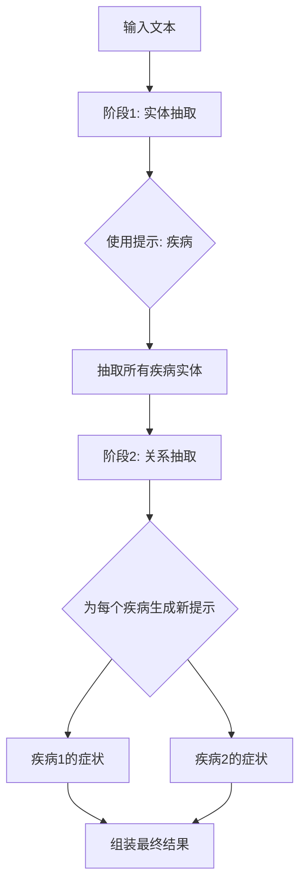

# AI-Medical UIE 项目学习指南

## 📋 项目概述

这是一个基于 **PyTorch** 的 **通用信息抽取（UIE - Universal Information Extraction）**系统，专门用于**中文医疗信息抽取（CMeIE - Chinese Medical Information Extraction）**。

### 核心特点

- **统一框架**：使用同一个模型处理多种信息抽取任务（实体识别、关系抽取、事件抽取）
- **提示学习**：通过自然语言提示词（Prompt）引导模型抽取特定信息
- **预训练模型**：基于百度的 ERNIE 模型（Enhanced Representation through kNowledge IntEgration）
- **医疗领域专用**：针对中文医疗文本优化

---

## 🏗️ 项目架构详解

### 1. 目录结构

```
ai-medical/
├── data/
│   └── annotated_data/
│       └── CMeIE-V2.jsonl          # 中文医疗信息抽取数据集
├── uie_pytorch/
│   ├── model.py                    # UIE 模型定义
│   ├── ernie.py                    # ERNIE 编码器实现
│   ├── ernie_m.py                  # ERNIE-M 多语言版本
│   ├── finetune.py                 # 训练脚本
│   ├── uie_predictor.py            # 推理预测器
│   ├── utils.py                    # 工具函数（数据处理、评估）
│   └── requirements.txt            # Python 依赖
└── debug_data/                     # 调试用小数据集
```

### 2. 核心模块分析

#### 📦 `model.py` - UIE 模型

**模型架构**：
```
输入文本 → ERNIE编码器 → 序列表示 → 起始/结束指针网络 → Sigmoid → 概率输出
```

**关键组件**：
- **编码器**：`ErnieModel` - 提取文本的上下文表示
- **指针网络**：
  - `linear_start`：预测实体/信息的起始位置
  - `linear_end`：预测实体/信息的结束位置
- **激活函数**：`Sigmoid` - 将 logits 转换为 [0,1] 概率

**损失函数**：
```python
loss = (BCE_loss(start_prob, start_label) + BCE_loss(end_prob, end_label)) / 2
```

#### 🔧 `utils.py` - 数据处理

**关键类**：

**`IEDataset`** - 数据集类
- 读取 JSONL 文件
- 将文本转换为模型输入格式
- 生成起始/结束位置标签

**输入格式转换**：
```
原始输入：
{
  "content": "患者出现高血压症状",
  "prompt": "症状",
  "result_list": [{"text": "高血压", "start": 4, "end": 7}]
}

模型输入：
[CLS] 症状 [SEP] 患者出现高血压症状 [SEP]
       ↑          ↑
    Prompt     Content
    
起始标签：[0, 0, 0, 0, 0, 0, 1, 0, 0, 0, 0, 0]  # 第6位为1（"高"的位置）
结束标签：[0, 0, 0, 0, 0, 0, 0, 0, 1, 0, 0, 0]  # 第8位为1（"压"的位置）
```

**`SpanEvaluator`** - 评估器
- 计算 Precision（精确率）
- 计算 Recall（召回率）
- 计算 F1-score

#### 🎯 `uie_predictor.py` - 推理预测

**多阶段推理流程**：



**示例**：
```python
# 输入
text = "糖尿病可能导致视力下降和肾功能损伤"
schema = ['疾病', {'疾病': ['症状', '并发症']}]

# 阶段1：抽取疾病
prompt1 = "疾病"
result1 = ["糖尿病"]

# 阶段2：抽取关系
prompt2 = "糖尿病的症状"
result2 = ["视力下降", "肾功能损伤"]

# 最终输出
{
  "疾病": [
    {
      "text": "糖尿病",
      "relations": {
        "症状": ["视力下降", "肾功能损伤"]
      }
    }
  ]
}
```

---

## 📊 数据格式详解

### CMeIE-V2.jsonl 数据格式

```json
{
  "text": "糖尿病是一种代谢性疾病，主要表现为高血糖",
  "spo_list": [
    {
      "predicate": "临床表现",
      "subject": "糖尿病",
      "subject_type": "疾病",
      "object": {
        "@value": "高血糖"
      },
      "object_type": {
        "@value": "症状"
      }
    }
  ]
}
```

**字段说明**：
- `text`：原始医疗文本
- `spo_list`：Subject-Predicate-Object 三元组列表
  - `subject`：主体实体（如：糖尿病）
  - `predicate`：关系类型（如：临床表现、病因、药物治疗）
  - `object`：客体实体（如：高血糖）

**常见关系类型**：
- 病理分型
- 病因
- 临床表现
- 药物治疗
- 辅助检查
- 鉴别诊断

---

## 🚀 使用指南

### 1. 环境配置

```bash
cd uie_pytorch
pip install -r requirements.txt

# 如果遇到兼容性问题，需要修复 transformers 版本问题
# 项目中已修复了 ernie.py 和 ernie_m.py 的兼容性
```

### 2. 数据准备

**训练数据格式**（需转换）：
```json
{
  "content": "原始文本",
  "prompt": "要抽取的信息类型",
  "result_list": [
    {"text": "抽取结果", "start": 0, "end": 4}
  ]
}
```

**转换脚本示例**：
```python
# 将 CMeIE 格式转换为 UIE 格式
def convert_cmeie_to_uie(cmeie_data):
    uie_samples = []
    for item in cmeie_data:
        text = item['text']
        for spo in item['spo_list']:
            # 实体抽取任务
            entity_sample = {
                'content': text,
                'prompt': spo['subject_type'],
                'result_list': [{
                    'text': spo['subject'],
                    'start': text.find(spo['subject']),
                    'end': text.find(spo['subject']) + len(spo['subject'])
                }]
            }
            uie_samples.append(entity_sample)
            
            # 关系抽取任务
            relation_sample = {
                'content': text,
                'prompt': spo['subject'] + '的' + spo['predicate'],
                'result_list': [{
                    'text': spo['object']['@value'],
                    'start': text.find(spo['object']['@value']),
                    'end': text.find(spo['object']['@value']) + len(spo['object']['@value'])
                }]
            }
            uie_samples.append(relation_sample)
    return uie_samples
```

### 3. 模型训练

```bash
python finetune.py \
    --train_path ../data/train.jsonl \
    --dev_path ../data/dev.jsonl \
    --save_dir ./checkpoint \
    --learning_rate 1e-5 \
    --batch_size 16 \
    --max_seq_len 512 \
    --num_epochs 10 \
    --model bert-base-chinese \  # 或使用预训练的 UIE 模型
    --device gpu  # 或 cpu
```

**训练参数说明**：
- `learning_rate`：学习率，建议 1e-5 到 5e-5
- `batch_size`：批次大小，根据显存调整
- `max_seq_len`：最大序列长度，医疗文本建议 512
- `num_epochs`：训练轮数

### 4. 模型推理

```python
from uie_predictor import UIEPredictor

# 定义抽取模式
schema = ['疾病', '症状', {'疾病': ['临床表现', '药物治疗']}]

# 初始化预测器
predictor = UIEPredictor(
    model='./checkpoint/model_best',  # 训练好的模型路径
    schema=schema,
    device='cpu',
    position_prob=0.5  # 置信度阈值
)

# 进行预测
text = "患者确诊为2型糖尿病，临床表现为多饮、多尿，建议服用二甲双胍治疗。"
result = predictor(text)
print(result)
```

**输出示例**：
```python
[{
  "疾病": [{
    "text": "2型糖尿病",
    "start": 5,
    "end": 10,
    "probability": 0.95,
    "relations": {
      "临床表现": [
        {"text": "多饮", "start": 15, "end": 17, "probability": 0.88},
        {"text": "多尿", "start": 18, "end": 20, "probability": 0.92}
      ],
      "药物治疗": [
        {"text": "二甲双胍", "start": 26, "end": 30, "probability": 0.91}
      ]
    }
  }]
}]
```

---

## 🔍 核心概念深度解析

### Prompt-based UIE 的优势

**传统方法 vs UIE**：

```
传统NER（命名实体识别）：
文本 → BERT → CRF/分类层 → 实体标签
问题：每个任务需要单独训练模型

UIE 统一框架：
[Prompt + 文本] → BERT → 指针网络 → 起始/结束位置
优势：
1. 一个模型处理多种任务
2. 通过改变 Prompt 控制抽取内容
3. 易于迁移到新任务（零样本/少样本）
```

### 指针网络（Pointer Network）原理

```
输入序列：[CLS] 症状 [SEP] 患者出现高血压症状 [SEP]
位置索引：  0    1   2    3  4  5 6 7 8  9   10

ERNIE编码：
         ↓
H = [h0, h1, h2, h3, h4, h5, h6, h7, h8, h9, h10]
    (每个hi是768维向量)

起始指针：
start_logits = Linear_start(H)  # → [11, 1]
start_prob = Sigmoid(start_logits)  # → [0.01, 0.02, 0.01, 0.03, 0.05, 0.92, ...]
                                     #        ↑ 第6位概率最高！

结束指针：
end_logits = Linear_end(H)  # → [11, 1]
end_prob = Sigmoid(end_logits)  # → [0.01, 0.01, 0.02, 0.03, 0.04, 0.06, 0.07, 0.95, ...]
                                   #                                              ↑ 第8位概率最高！

抽取结果：
span = 文本[6:8+1] = "高血压"
```

---

## ⚠️ 常见问题与解决

### 问题1：transformers 版本兼容性

**错误信息**：
```
ImportError: cannot import name 'apply_chunking_to_forward'
```

**解决方案**：
项目已为 `ernie.py` 和 `ernie_m.py` 打了补丁，禁用了已废弃的函数。如果遇到其他兼容性问题：

```python
# 在 ernie.py 和 ernie_m.py 中
# 替换：
layer_output = apply_chunking_to_forward(...)

# 为：
layer_output = self.feed_forward_chunk(attention_output)
```

### 问题2：数据格式不匹配

**错误信息**：
```
KeyError: 'content'
```

**原因**：训练数据需要是 UIE 格式，而不是原始的 CMeIE 格式。

**解决方案**：使用上面提供的转换脚本将数据转换为正确格式。

### 问题3：模型文件缺失

**错误信息**：
```
OSError: uie_base_pytorch/pytorch_model.bin not found
```

**解决方案**：
1. 下载完整的预训练模型
2. 或者使用 `bert-base-chinese` 从头训练

---

## 📚 学习建议

### 1. 理解学习路径


### 2. 实践建议

1. **先运行小数据集**：使用 `debug_data/` 快速验证流程
2. **逐步调试**：从数据加载 → 模型前向传播 → 损失计算 → 反向传播
3. **可视化输出**：打印中间结果理解数据流
4. **对比论文**：阅读 UIE 原始论文理解设计思想

### 3. 扩展方向

- **新领域适配**：使用医疗之外的数据（法律、金融）
- **模型优化**：尝试不同的预训练模型（RoBERTa, ALBERT）
- **多任务学习**：同时训练多种抽取任务
- **小样本学习**：研究如何用少量标注数据获得好效果

---

## 🎓 参考资源

- **UIE 论文**：Unified Structure Generation for Universal Information Extraction
- **ERNIE 论文**：ERNIE: Enhanced Language Representation with Informative Entities
- **数据集**：CMeIE - Chinese Medical Information Extraction Dataset
- **HuggingFace Transformers 文档**：https://huggingface.co/docs/transformers

---

> **提示**：这个项目是学习现代 NLP 信息抽取技术的绝佳案例。建议从数据处理开始，逐步深入到模型架构和训练流程。遇到问题时，可以通过调试小数据集来定位问题！
